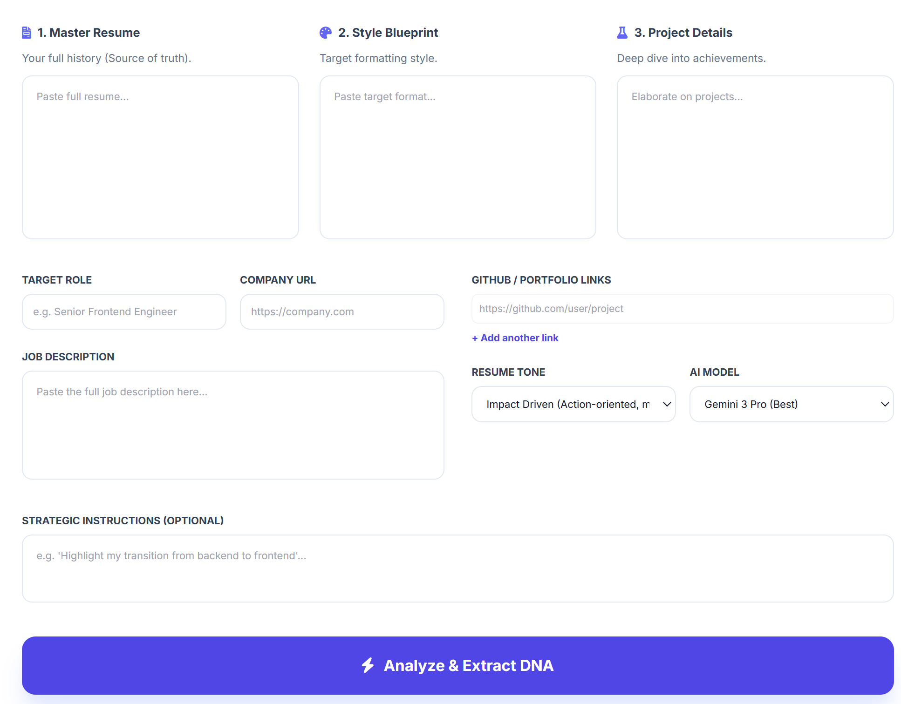

# 🖋️ ResumeTailor AI
### *The Strategic Engineer's Guide to Automated Resume Optimization*

ResumeTailor AI is not a simple "rewriter." It is a **Strategic Optimization Suite** that uses Gemini 3 Pro to perform real-time company research and ground your professional experience in the specific "DNA" of a target role.

---

## 🛠 Prerequisites

This app uses a **Bring Your Own Key (BYOK)** model. To use it, you need:
1. **A Google Cloud Project** with the [Generative AI API](https://console.cloud.google.com/apis/library/generativeai.googleapis.com) enabled.
2. **Billing Enabled** (Gemini 3 Pro requires a paid tier project, though usage for individual resumes is typically pennies).
3. **The Link**: When you open the app, click **"Link My Project"** to connect your secure environment. This triggers a **native browser project selector**, ensuring the application never handles your secret keys directly.

---

## 🏁 Step-by-Step Workflow

### Phase 1: The Input Engine
The quality of your tailored resume depends entirely on the "Source of Truth" you provide.
1. **Master Resume**: Paste your longest, most comprehensive resume. Don't worry about length; the AI uses this as its primary database.
2. **Formatting Blueprint**: Paste a sample resume or a specific layout you like. The AI will mirror the hierarchy, font-weighting (via Markdown), and section ordering of this blueprint, allowing you to bypass **culture-specific formatting biases** (e.g., Finance vs. Big Tech).
3. **Detailed Projects**: **CRITICAL.** Paste raw technical notes, bullet points, or READMEs from your projects. **Pro-tip:** Paste the actual `README.md` files from your repos here; this is the highest-fidelity data for finding "hidden" skills.
4. **Personal & Portfolio Links**: Add links to your GitHub, LinkedIn, Google Scholar, or Portfolio. This enables **"Live Grounding"**—the AI uses Google Search to cross-reference your claims against your public commits and endorsements to verify technical proficiency.
5. **Strategic Guidance**: Tell the AI your "vibe." (e.g., *"Focus on my leadership in bridging AI to scientific projects even though I was a junior"* or *"Highlight my transition from science to machine learning"*).

  
  
<i>Conceptual Preview: From Raw Data to Tailored PDF</i>

### Phase 2: Strategic Review
After the AI researches the company and the role:
- **Audit Keywords**: Remove any skills the AI "hallucinated" or that you don't want to emphasize. Use this phase to **manually inject** skills you forgot to include in your master resume, effectively updating your profile on-the-fly.
- **Edit Recommendations**: The AI proposes 5 strategic "moves." You can rewrite these manually if you want the AI to take a different tactical approach or you can modify them.
- **Cover Letter**: Select your target language and provide any specific "hook" you want. The AI grounds this letter in the **Phase 1 Company Research**, referencing specific values or tech-stack shifts it found online.

### Phase 3: Export & Metrics
- **ATS Match Score**: Review your estimated match percentage. This is a **dynamic "Truth-o-meter"**; removing keywords during the Audit Phase will realistically lower this score.
- **Download**: Export as a professional `.docx` or copy the raw Markdown for your portfolio.

---

## 💡 How to Help the AI (Pro Tips)

To get 99th-percentile results, follow these prompting strategies within the app:

### 1. The "Quantification Mandate" & Impact Clusters
In the **Detailed Projects** section, always include numbers. 
*   *Bad:* "Improved database performance."
*   *Good:* "Reduced query latency by 40% (from 200ms to 120ms) by implementing Redis caching."
The AI uses **"Impact Clusters"** (grouping metrics by specific technical context) to write more cohesive performance chapters in the final output.

### 2. Steering the AI via "Strategic Guidance"
Use the **Strategic Guidance** box as a steering wheel.
*   **Targeting a Startup?** *"Use a high-energy, high-ownership tone. Focus on my ability to build from 0 to 1."*
*   **Targeting FAANG?** *"Use precise, metrics-heavy language. Emphasize scale and cross-functional collaboration."*

### 3. Use the Blueprint for Layout
If the target company has a specific resume style (e.g., the "Google Resume"), find a template online, copy the text, and paste it into the **Formatting Blueprint**. **Hack:** If you don't have a template, paste a **LinkedIn "Save to PDF"** text dump to mirror a standard professional structure.

---

## 🔒 Privacy & Data Sovereignty

- **No Server Storage**: Your resume, projects, and keys are never stored on our servers. 
- **Direct Connection**: The app creates a direct encrypted tunnel between your browser and your Google Cloud Project.
- **Session Based**: Once you close the tab, all input data is cleared from the browser's memory.

---

## 🧪 Technical Implementation

- **Framework**: React 19 + TypeScript.
- **LLM**: Gemini 3 Pro (via `@google/genai`). There are 3 choices of models based on price and lightness of the output, chosen by the user.
- **Grounding**: Google Search (used for company research phase and portfolio verification).
- **Document Generation**: High-fidelity **client-side .docx generation** ensures your data never leaves your browser during export.
- **Styling**: Tailwind CSS + Swiss-Modern Design Principles.

---

**Built for the ambitious. Tailored for the win.**  
*Disclaimer: This tool is an assistant. Always perform a final human review of your documents before submitting. This tool is not supposed to replace human. *now you can implement improvements but you are not allowed to remove any section or bullet.
